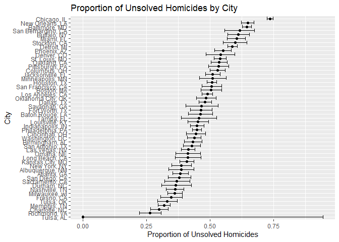

p8105_hw5_ns3782
================
NSK
2024-11-03

# Problem 1

``` r
# Define function to check for shared birthdays

check_birthday = function(n) {
  birthdays = sample(1:365, size = n, replace = TRUE)
  return(length(unique(birthdays)) < n)
}

# Run simulations

birthday_results = 
  expand_grid(
    n = 2:50,
    iter = 1:10000
  ) %>%
  mutate(result = map_lgl(n, check_birthday))  %>%
  group_by(n)  %>%
  summarise(prob = mean(result))

# Plot results

ggplot(birthday_results, aes(x = n, y = prob)) + 
  geom_line() +
  labs(x = "Group Size", y = "Probability") 
```

<!-- -->

# Problem 2

``` r
# Set fixed values: sample size (n), sigma (5), nsims (5000), alpha (0.05)

n = 30      
sigma = 5  
nsims = 5000 
alpha = 0.05  

# Function to run t-test and get results for one dataset

sim_test = function(n_obs, mu_val, sigma_val) {
  
  # Generate normal data: x ~ Normal[μ,σ]
  
  sim_data = rnorm(n = n_obs, mean = mu_val, sd = sigma_val)
  
  # Test H₀: μ = 0
  
  t.test(sim_data, mu = 0) %>% 
    broom::tidy()
}


# For μ = 0: Generate 5000 (nsims) datasets and save μ hat and p value

results_mu0 = 
  tibble(
    iter = 1:nsims
  ) %>% 
  mutate(
    results = map(iter, function(x) sim_test(n, mu_val = 0, sigma))
  ) %>% 
  unnest(results) %>%
  select(iter, estimate, p.value) 

# Repeat for μ = {1,2,3,4,5,6}

results_other = 
  expand_grid(
    iter = 1:nsims,
    true_mu = c(1, 2, 3, 4, 5, 6)
  ) %>% 
  mutate(
    results = map(true_mu, function(x) sim_test(n, mu_val = x, sigma))
  ) %>% 
  unnest(results) %>%
  select(iter, true_mu, estimate, p.value) 
```

## Plot 1: Power vs True value of μ

``` r
# Add all our simulation results in one dataset

all_results = bind_rows(
  results_mu0 %>% mutate(true_mu = 0),  
  results_other                          
)

# Calculate statistics needed for both plots: power (first plot) and average estimates (second plot)

summary_stats = all_results %>%
  group_by(true_mu) %>%                             
  summarise(
    power = mean(p.value < 0.05),
    avg_estimate = mean(estimate),                 
    avg_estimate_reject = mean(estimate[p.value < 0.05])  
  )

# Plot 1: Power vs. true value of μ 

ggplot(summary_stats, aes(x = true_mu, y = power)) +
  geom_line() +
  geom_point() +
  labs(
    x = "True value of μ",
    y = "Power (proportion of rejected nulls)",
    title = "Power vs True value of μ"
  ) 
```

<!-- --> As
the true value of μ increases (effect size gets larger), the power of
the test increases. The relationship isn’t linear - power increases
rapidly at first (between μ = 1 and μ = 3), then levels off around μ =
4, eventually reaching close to 100% power. This means we’re more likely
to detect larger effects, and once the effect size is big enough (around
μ = 4), we almost always reject the null hypothesis.

## Plot 2: Average estimate of μ hat plots

``` r
# Plot 2:
# Line 1: Average estimate of μ hat vs true value of μ
# Line 2: Average estimate of μ hat only in null rejected samples vs true value of μ

ggplot(summary_stats, aes(x = true_mu)) +
  geom_line(aes(y = avg_estimate, color = "All samples")) +
  geom_line(aes(y = avg_estimate_reject, color = "Null rejected samples only")) +
  labs(
    x = "True value of μ",
    y = "Average estimate of μ hat",
    title = "Average Estimates vs True μ: All Samples vs Null rejected Samples Only",
    color = "Sample Type"
  ) +
  scale_color_manual(values = c("black", "skyblue"))
```

<!-- -->

No, the sample average of μ hat from rejected tests is not approximately
equal to the true value of μ, especially when the true μ is small. This
is because we only reject the null hypothesis (get p \< 0.05) when we
happen to get more extreme estimates by chance. So when we only look at
these rejected tests, we’re selecting for the larger estimates, which
makes our average higher than the true value. However, we can see from
the plot that when μ gets larger, the rejected-samples average (blue
line) gets closer to the true value (black line). This happens because
with large μ values, we reject H0 (the null) most of the time anyway, so
we are including almost all samples in our average rather than just the
more extreme ones.

# Problem 3: Homicides in U.S. Cities

``` r
# Load CSV data

homicide_data <- 
  read_csv("homicide-data.csv") 
```

    ## Rows: 52179 Columns: 12
    ## ── Column specification ────────────────────────────────────────────────────────
    ## Delimiter: ","
    ## chr (9): uid, victim_last, victim_first, victim_race, victim_age, victim_sex...
    ## dbl (3): reported_date, lat, lon
    ## 
    ## ℹ Use `spec()` to retrieve the full column specification for this data.
    ## ℹ Specify the column types or set `show_col_types = FALSE` to quiet this message.

``` r
# Create city_state variable and summarise homicides

homicide_data <- homicide_data %>%
  mutate(city_state = str_c(city, ", ", state)) %>%
  mutate(reported_date = as.character(reported_date)) %>%
  mutate(reported_date = as.Date(reported_date, format = "%Y%m%d"))

# Summarise homicides

homicide_data %>%
  group_by(city_state) %>%
  summarise(
    total_homicides = n(),
    unsolved_homicides = sum(disposition %in% c("Closed without arrest", "Open/No arrest")),
    solved_homicides = sum(disposition == "Closed by arrest")
  )
```

    ## # A tibble: 51 × 4
    ##    city_state      total_homicides unsolved_homicides solved_homicides
    ##    <chr>                     <int>              <int>            <int>
    ##  1 Albuquerque, NM             378                146              232
    ##  2 Atlanta, GA                 973                373              600
    ##  3 Baltimore, MD              2827               1825             1002
    ##  4 Baton Rouge, LA             424                196              228
    ##  5 Birmingham, AL              800                347              453
    ##  6 Boston, MA                  614                310              304
    ##  7 Buffalo, NY                 521                319              202
    ##  8 Charlotte, NC               687                206              481
    ##  9 Chicago, IL                5535               4073             1462
    ## 10 Cincinnati, OH              694                309              385
    ## # ℹ 41 more rows

The homicides dataset contains information about multiple U.S. cities.
The dataset has 52179 homicide cases with 13 variables: uid,
reported_date, victim_last, victim_first, victim_race, victim_age,
victim_sex, city, state, lat, lon, disposition, city_state. The cases
span from 2007-01-01 through 2017-12-31.

The data covers 51 cities. The victim demographics include age (ranging
from 0 to Unknown years), sex (Male, Female, Unknown), and race
(Hispanic, White, Other, Black, Asian, Unknown). Case dispositions fall
into three categories: Closed without arrest, Closed by arrest, Open/No
arrest.

``` r
# Estimate the proportion of homicides that are unsolved in Baltimore

baltimore_unsolved <- homicide_data %>%
  filter(city_state == "Baltimore, MD") %>%
  summarize(
    unsolved = sum(disposition %in% c("Closed without arrest", "Open/No arrest")),
    n = n()
  ) %>%
  with(prop.test(unsolved, n)) %>%
  broom::tidy() %>%
  select(estimate, conf.low, conf.high)

# Display proportion of homicides that are unsolved in Baltimore

baltimore_unsolved
```

    ## # A tibble: 1 × 3
    ##   estimate conf.low conf.high
    ##      <dbl>    <dbl>     <dbl>
    ## 1    0.646    0.628     0.663

``` r
# Estimate the proportion of homicides that are unsolved for all cities

unsolved_prop_cities <- homicide_data %>%
  group_by(city_state) %>%
  summarise(
    unsolved = sum(disposition %in% c("Closed without arrest", "Open/No arrest")),
    n = n()
  ) %>%
  mutate(
    test_results = map2(unsolved, n, ~prop.test(x = .x, n = .y)),
    tidy_results = map(test_results, broom::tidy)
  ) %>%
  unnest(tidy_results) %>%
  select(city_state, estimate, conf.low, conf.high)
```

    ## Warning: There was 1 warning in `mutate()`.
    ## ℹ In argument: `test_results = map2(unsolved, n, ~prop.test(x = .x, n = .y))`.
    ## Caused by warning in `prop.test()`:
    ## ! Chi-squared approximation may be incorrect

``` r
# Proportion of unsolved homicides for all cities

unsolved_prop_cities
```

    ## # A tibble: 51 × 4
    ##    city_state      estimate conf.low conf.high
    ##    <chr>              <dbl>    <dbl>     <dbl>
    ##  1 Albuquerque, NM    0.386    0.337     0.438
    ##  2 Atlanta, GA        0.383    0.353     0.415
    ##  3 Baltimore, MD      0.646    0.628     0.663
    ##  4 Baton Rouge, LA    0.462    0.414     0.511
    ##  5 Birmingham, AL     0.434    0.399     0.469
    ##  6 Boston, MA         0.505    0.465     0.545
    ##  7 Buffalo, NY        0.612    0.569     0.654
    ##  8 Charlotte, NC      0.300    0.266     0.336
    ##  9 Chicago, IL        0.736    0.724     0.747
    ## 10 Cincinnati, OH     0.445    0.408     0.483
    ## # ℹ 41 more rows

## Plot

``` r
# Plot showing proportion of unsolved homicides for all cities

unsolved_prop_cities %>%
 mutate(city_state = reorder(city_state, estimate)) %>%
 ggplot(aes(x = city_state, y = estimate)) +
 geom_point() +
 geom_errorbar(aes(ymin = conf.low, ymax = conf.high)) +
 coord_flip() +
 labs(
   x = "City",
   y = "Proportion of Unsolved Homicides",
   title = "Proportion of Unsolved Homicides by City"
 )
```

<!-- -->
